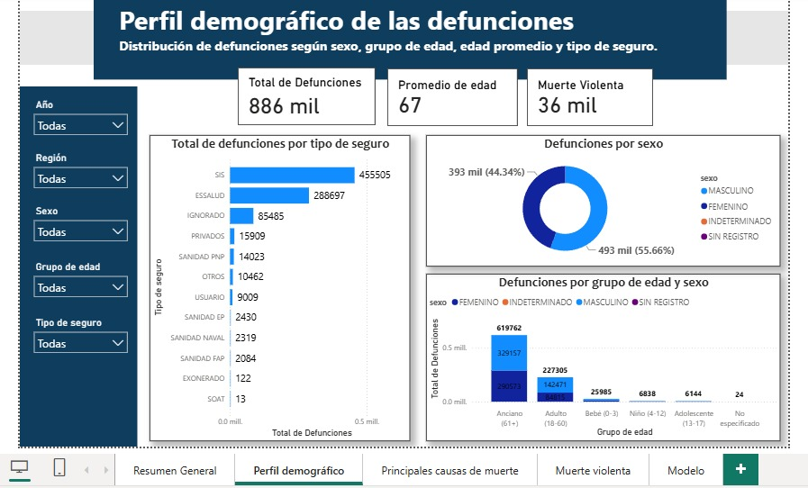
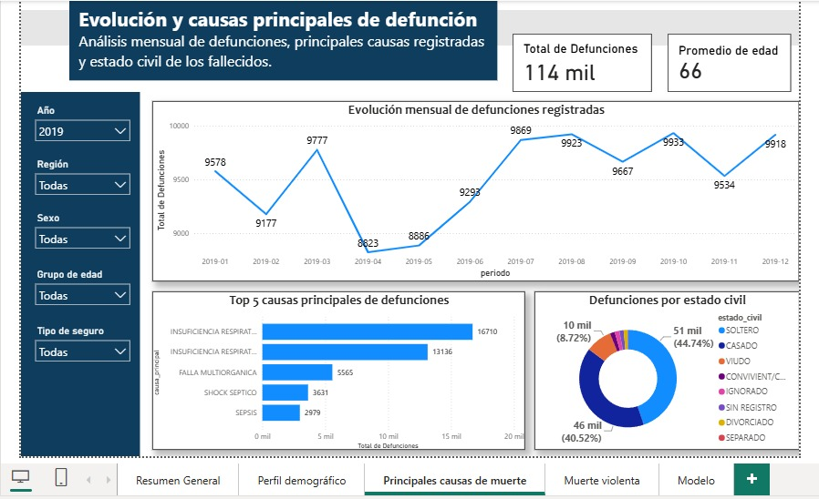
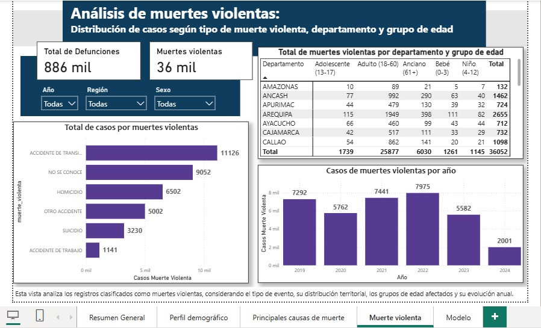
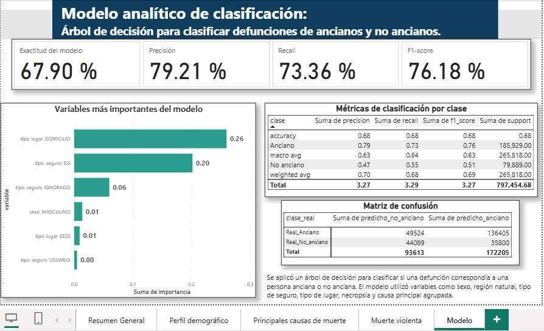

# Análisis de Mortalidad en el Perú 2019-2024 (SINADEF)

El presente trabajo integrador analizó la dinámica de las defunciones registradas en el Perú durante el periodo 2019-2024. Para ello, se extrajo y procesó la base de datos del SINADEF mediante la implementación de un flujo ETL estructurado en Python y PostgreSQL. La investigación se enmarcó en un enfoque cuantitativo, con un diseño no experimental y un alcance descriptivo-analítico. La preparación de los datos contempló la depuración exhaustiva de registros y la normalización de variables geográficas utilizando el estándar UBIGEO, lo que permitió incorporar una clasificación precisa por región natural.
Como resultado, se consolidó una base de datos final validada de 886 058 registros, abarcando 25 departamentos del país.

### Dashboard:

### Enlaces al Proyecto:
Debido al peso de los datos originales, la base completa y el archivo interactivo se encuentran alojados en la nube:
* 📈 [Descargar Dashboard Interactivo en Power BI (.pbix)](https://drive.google.com/drive/folders/1vjAlDQqPlci5yjLuoqxg2YAJ2lejtuU5?usp=sharing)
* 📁 [Descargar Dataset Completo SINADEF](https://drive.google.com/drive/folders/1TCnC-oqFaUS0AzrA8rYehJIo-uZ6mwQh?usp=drive_link)
  
